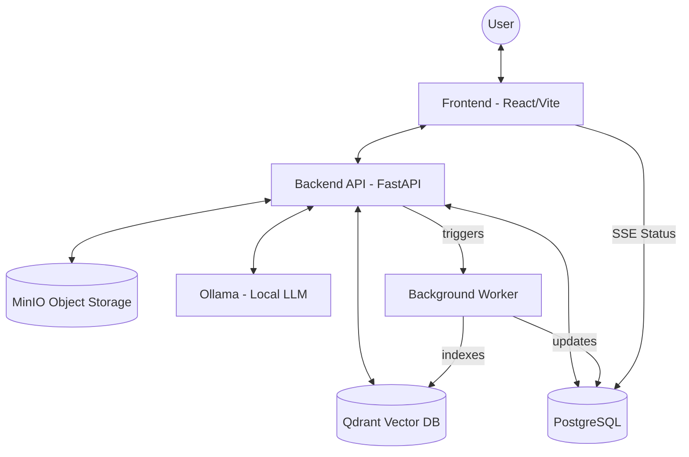

# BankAi: Technical Architecture

This document provides a deep dive into the architecture of the BankAi platform, focusing on high-fidelity features, data isolation, and the asynchronous document pipeline.

## 1. System Architecture Diagram

## 2. Component Breakdown

### 2.1 Frontend (React + Vite)
*   **State Management:** Uses React `useState` and `useCallback` for session and document management.
*   **Streaming Logic:** 
    *   Handles **Token Streaming** via fetch readable streams for real-time AI responses.
    *   Handles **Status Streaming** via `EventSource` (SSE) for document processing tracking.
*   **Design System:** Built with Tailwind CSS following a custom "Fintech Dark" aesthetic (Gradients, Glassmorphism, and high-contrast typography).

### 2.2 Backend (FastAPI + SQLModel)
*   **API Design:** RESTful API for session management and file handling; SSE for long-running notifications.
*   **Asynchronous Tasks:** Uses FastAPI `BackgroundTasks` to handle document ingestion without blocking user interaction.
*   **Guardrails:** Integrated PII detection and prompt injection protection layers.

### 2.3 RAG Pipeline (Qdrant + LangChain)
*   **Ingestion:** 
    *   Text extraction (PyPDF, Docx, Vision-LLM for images).
    *   Chunking (RecursiveCharacterTextSplitter).
    *   Embedding (Sentence-Transformers).
*   **Retrieval:** 
    *   Vector search with metadata filtering for `bank_id`.
    *   Strict session isolation: documents uploaded in a specific `session_id` are only retrievable within that session.

## 3. Data Isolation & Security

### 3.1 Multi-Tenancy
Data is partitioned at the database and vector levels using `bank_id`. Every query is enforced with a `WHERE bank_id = :bank_id` constraint.

### 3.2 Session Isolation
Chat session documents are tagged with `document_scope = "session_upload"`. The RAG query engine ensures that session-specific uploads are only included in the search context if they match the current active `session_id`.

## 4. Document Processing Lifecycle

1.  **Selection:** User selects a file in the UI.
2.  **Upload:** Frontend POSTs to `/api/chat/sessions/{id}/files`.
3.  **Handoff:** API saves file to MinIO and spawns a background worker.
4.  **OCR/Parsing:** Worker extracts text (uses Vision LLM if file is an image).
5.  **Indexing:** Worker chunks text, generates embeddings, and upserts to Qdrant.
6.  **Streaming:** During steps 4-5, the worker updates the DB status, which is streamed to the UI.
7.  **Completion:** UI card turns "Ready", enabling context-aware chat.

---

## 5. Deployment Infrastructure

*   **Orchestration:** Docker Compose.
*   **Scaling:** The backend is stateless and can be scaled horizontally. Qdrant and PostgreSQL should be configured with persistent volumes for data durability.
*   **LLM Performance:** `OLLAMA_KEEP_ALIVE=-1` is critical for avoiding cold-start latency during predictive follow-up generation.
